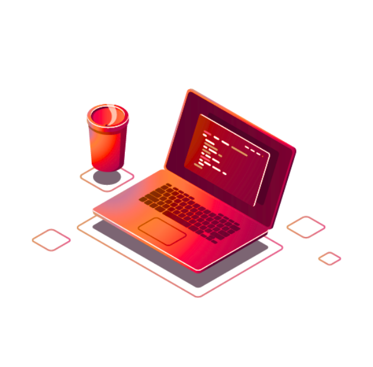

#  Mateus Nóbrega 
**`Desenvolvedor Júnior | FullStack`**

Sou Desenvolvedor Júnior na **Eletrografite Escovas de Carvão e Acessórios**, atuando com desenvolvimento em C# e JavaScript, automatização de tarefas e criação de soluções voltadas para a evolução dos processos internos da empresa. Anteriormente, atuei como Desenvolvedor Júnior na **GO Technology**, trabalhando com Next.js, NestJS e C#, desenvolvendo templates visuais, aplicações web e soluções internas. Atualmente curso Análise e Desenvolvimento de Sistemas e sou movido por aprendizado contínuo, colaboração e evolução técnica.

  

##  Linguagens e Tecnologias

### **`Principais Linguagens e Frameworks`**

  

 ### **`Outras Tecnologiass`**

  

---

 ### **`Ferramentas`**

  

---

 ### **`Contatos`**

---

