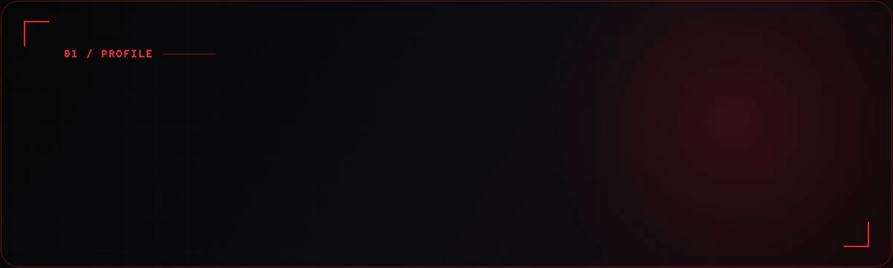
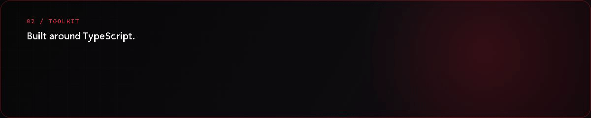

  <strong>Português</strong> · <a href="./README.en.md">English</a>

  

### Olá — eu sou o Mateus.

Desenvolvedor Full Stack formado em Análise e Desenvolvimento de Sistemas. Trabalho na **Eletrografite**, criando aplicações internas, integrações e automações com TypeScript, C# e Python. Antes disso, atuei na **GO Technology** com Next.js e JavaScript.

Gosto de software direto ao ponto: interfaces claras, APIs bem definidas e automações que eliminam trabalho repetitivo.

  <a href="https://www.linkedin.com/in/mateusndj">LinkedIn</a> ·
  <a href="https://github.com/MateusNDJ?tab=repositories">Repositórios</a>

 

  

  &nbsp;&nbsp;
  &nbsp;&nbsp;
  &nbsp;&nbsp;
  &nbsp;&nbsp;
  &nbsp;&nbsp;
  &nbsp;&nbsp;
  &nbsp;&nbsp;
  &nbsp;&nbsp;
  &nbsp;&nbsp;
  

### Projetos selecionados

| | Projeto | Descrição |
| :---: | :--- | :--- |
| `01` | [**Chatbot E-commerce**](https://github.com/MateusNDJ/Chatbot-C-) | Atendimento inteligente integrado ao Google Gemini, desenvolvido com C# e .NET. |
| `02` | [**Painel de Entregadores**](https://github.com/MateusNDJ/painel_entregadores) | Gestão de rotas e localização em tempo real com JavaScript, Firebase e Leaflet. |
| `03` | [**CineMatch**](https://github.com/MateusNDJ/Cinematch) | Quiz de compatibilidade cinematográfica com recomendações da API do TMDB. |

### Formação e certificações

| Formação / certificação | Instituição | Conclusão |
| :--- | :--- | :---: |
| **Análise e Desenvolvimento de Sistemas** | FIAP | 2026 |
| **Cybersecurity** | FIAP | 2024 |
| **Java SE 7 Programmer I** | Alura | mai/2024 |
| **Big Data** | FIAP | nov/2025 |
| **Perícia Forense em Defesa Cibernética** · 80h | FIAP Nano Course | set/2026 |
| **Cybersecurity Hacker Skills** · 120h | FIAP Nano Course | set/2026 |

---

  Disponível para trocar ideias, colaborar e construir produtos úteis.

